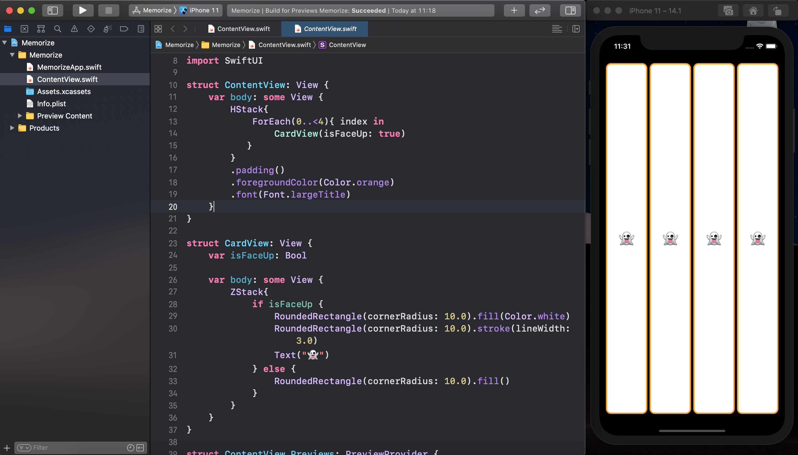
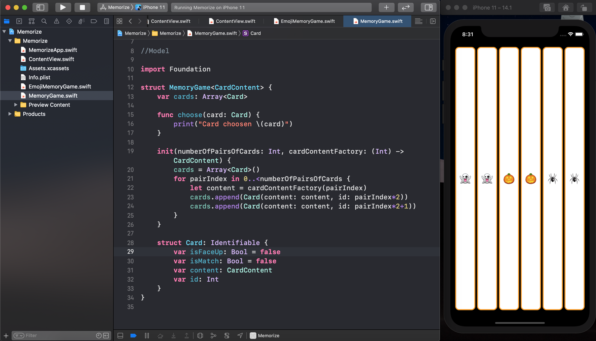

# Memorize App 

<h4 align="center">
 
 <b>CS193p - Developing Applications for iOS using SwiftUI</b> 📚
</h4>

 

### Lecture 1

After going over the mechanics of how the course works, this first lecture dives right into creating an iOS application (a card-matching game called Memorize).  The Xcode development environment is used to demonstrate the basics of SwiftUI's declarative approach to composing user-interfaces.

<h4 align="center">
 
</h4>

 

### Lecture 2

Conceptual overview of the architectural paradigm underlying the development of applications for iOS using SwiftUI: MVVM.  In addition, a key underpinning of the Swift Programming Language, its type system, is explained.  The Memorize demonstration continues, incorporating MVVM.

<h4 align="center">
 
</h4>

 
